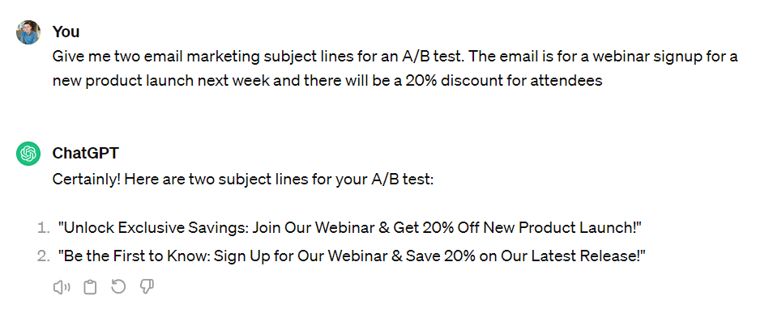
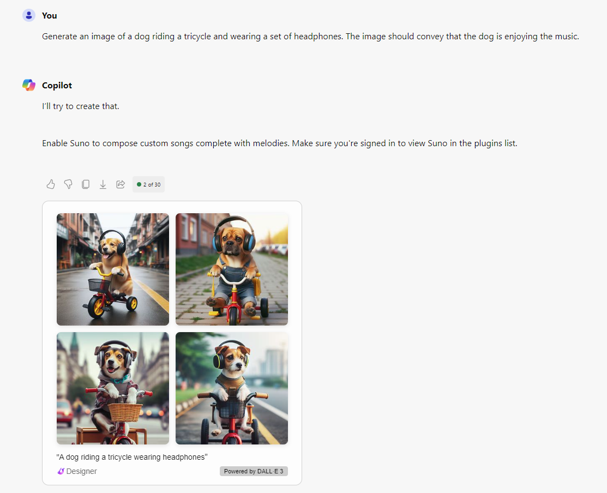
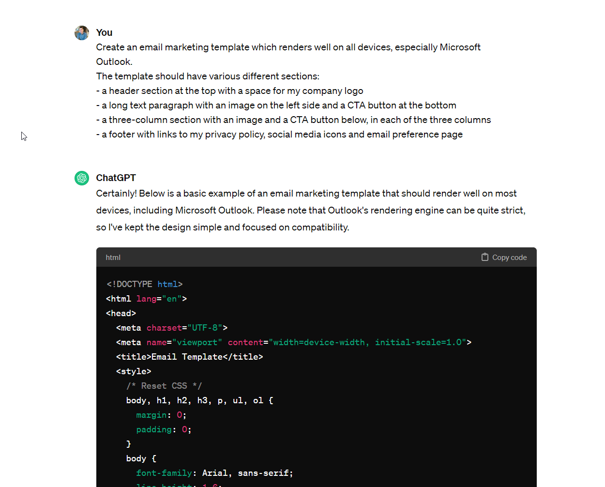
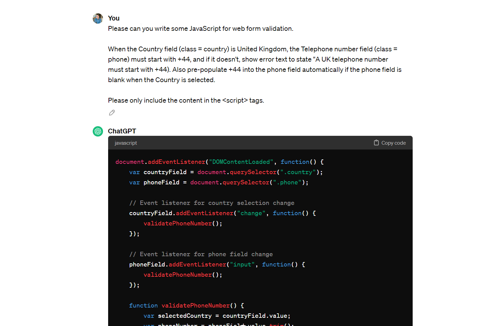
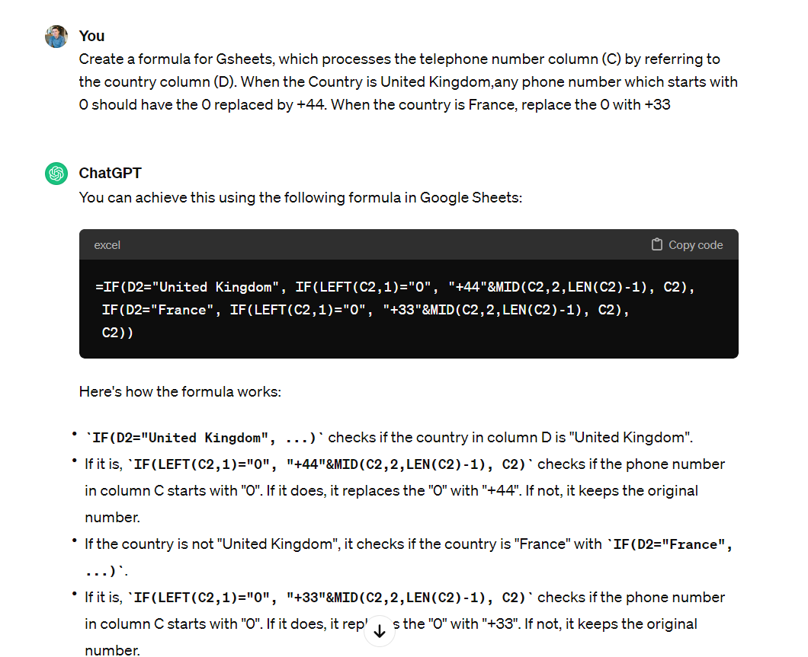

If you've ever attended a Salesforce World Tour event, you'll be familiar with whichever VP is on speaker duty, talking about Industrial Revolutions. They use this phrasing to indicate huge societal and business transformations driven by technology. Sounds dramatic, right? Well, you've seen nothing yet - Salesforce is saying that Artificial Intelligence is part of the fourth wave, and according to Marc Benioff, the "AI wave will be the biggest that anyone has ever seen."

Of course, Salesforce would like nothing better than to sell you a bunch of capabilities around AI embedded directly in their products, but before you get your cheque book out, I've outlined 5 ways Pardot (Marketing Cloud Account Engagement) Admins can use today, with only the help of a free ChatGPT account.

Text Content Creation
---------------------

Let's start with the most obvious. Creating marketing copy is the easiest way to dip your toes in the Generative AI pond. You can start simple, by getting some ideas for different subject lines to A/B test, right through to generating landing page or email copy, which would require more complex prompts.

My recommended approach is to use Gen AI as a way to avoid starting from a blank page, rather than expecting a fully-usable output without edits - even getting ChatGPT to recommend headings for a landing page will hugely speed up your content ideation, without you risking using machine-generated content on your landing pages which will surely be nerfed in an upcoming Google search algorithm update.

**Example Prompt**

Give me two email marketing subject lines for an A/B test. The email is for a webinar signup for a new product launch next week and there will be a 20% discount for attendees

Image Generation
----------------

If, like me, you were working in marketing 10+ years ago, you'll surely remember the pain of hunting through stock image websites and having to pay for barely-relevant images for your emails and landing pages. Dall-E is a game changer in this space, because suddenly that very specific photo of a dog-riding-a-tricycle-using-your-brand's-headphones.jpeg is suddenly not only available to you, but downright easy to get a hold of.

Before you go overboard, the same disclaimer as above applies, that I'd be very careful using ai-generated images on a page indexed by Google - we simply don't know what the long term impact will be. But for email marketing in particular, there's a huge amount of upside for this use case in terms of speed and cost.

**Example Prompt**

Generate an image of a dog riding a tricycle, wearing a set of headphones. The image should convey that the dog is moving at speed and enjoying listening to music.

Template Creation
-----------------

My single favourite use case relates to using Generative AI to produce email or landing page templates for Pardot. I've included an example prompt below, along with an example of the code which ChatGPT can output. Of course, you'll need to add in your company logo and hyperlinks and thoroughly test that this works correctly on all devices and screen sizes, but this can be a game changer in terms of how quickly you can create and roll out new templates.

Once you've tried this a few times, you can even go more advanced by providing instructions in your prompts around how ChatGPT can include Pardot-specific code for editable and movable regions.

**Example prompt:**
Create an email marketing template which renders well on all devices, especially Microsoft Outlook.
The template should have various different sections:
- a header section at the top with a space for my company logo
- a long text paragraph with an image on the left side and a CTA button at the bottom
- a three-column section with an image and a CTA button below, in each of the three columns
- a footer with links to my privacy policy, social media icons and email preference page

Code fixes
----------

Don't know JavaScript? You'll generally be fine in Pardot, but once you want to look at some advanced use cases around landing page or form formatting or validations, you might hit the limits of what can be configured in the platform. I've been surprised with how well this actually works, and if you don't have a dedicated developer in your team, it's worth at least trying this. I've included an example below. I doubt the code actually works without some tweaks, but I've also had success with replying "this didn't work" and then having a back-and-forth around how to fix it - usually this is based on an assumption the model has made around the HTML code structure - Pardot's form structure has some *quirks*.

**Example prompt:**

Please can you write some JavaScript for web form validation.

When the Country field (class = country) is United Kingdom, the Telephone number field (class = phone) must start with +44, and if it doesn't, show error text to state "A UK telephone number must start with +44". Also pre-populate +44 into the phone field automatically if the phone field is blank when the Country is selected.

Please only include the content in the script tags.

Data cleansing
--------------

Another surprising use case for Generative AI is that it's really useful for helping to clean data. Not by directly pasting in data into the prompt editor, but instead by using it to help you with Excel or Gsheet formulae. If you're a spreadsheet wizard, you can do this yourself, but I've had a couple of use cases where I've struggled with a complex nested formula or an array formula where Gen AI has come up with the answer and saved me a huge amount of time and pain.

You can generate formulae to help you clean your data quickly before uploading to Pardot, or to clean and re-import any existing bad data. To extend the phone number example from the Javascript above, here's an approach with a Gsheet formula:

**Example prompt:**

Create a formula for Gsheets, which processes the telephone number column (C) by referring to the country column (D). When the Country is United Kingdom,any phone number which starts with 0 should have the 0 replaced by +44. When the country is France, replace the 0 with +33.

Do you have any hidden gem use cases not mentioned above? Feel free to leave a comment below.