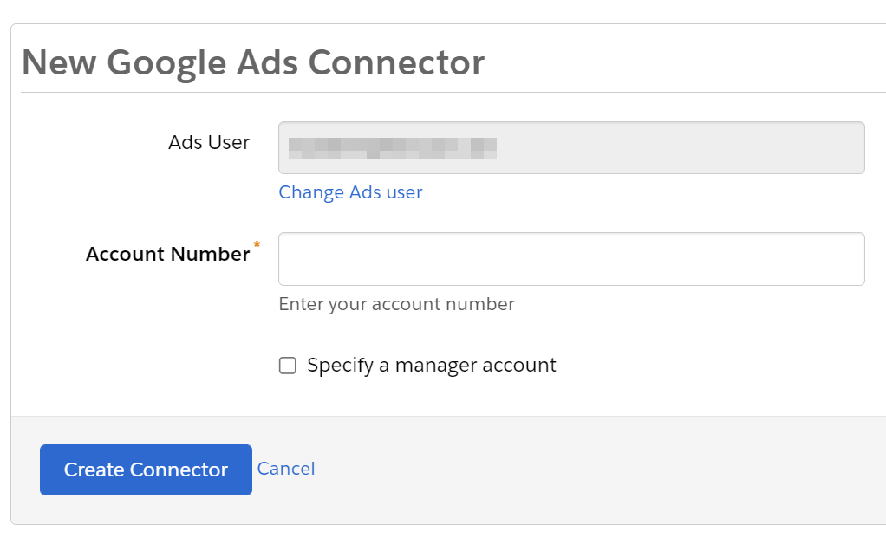
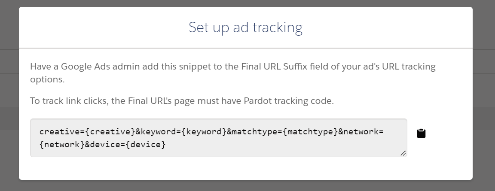

## Introduction

What do Pardot and Google Ads have in common? They both had a somewhat questionable name change from a recognisable brand to a very generic and difficult-to-research product name. So whether you found this article using the good old names, or the newer names, what we'll try and unpack here, is the typical steps for getting Marketing Cloud Account Engagement and Google Ads to "talk" to each other.

As a marketer, you're measured on delivering a great Return on Marketing Investment (ROMI). So you're going to want to make sure that the Google Ads you run, generate a net positive outcome for your organization. That's where the Pardot Google Ads (formerly known as Adwords) connector comes in.

## What does the connector do?

It's important to start by explaining what the connector does and doesn't do. A common misconception, is that the connector allows you to manage your Ads in Pardot. In fact, it doesn't have that capability -- Google Ads is a highly complex and customizable tool, which wouldn't be practical to replicate all the functionality around how to set up, target and bid for Ads in Pardot. So you'll still need to create and edit your ads directly in Google's interface. However what the connector **does** do, is give you insights directly in Pardot about the performance of your ads and which Prospects they've influenced.

The way I like to describe the connector, is that Google Ads out of the box gives you plenty of insight into the aggregated performance of your ads, such as the ranking of your Ads, the number of clicks, and the number of "conversions" on your website, whatever you define a conversion to be (if you have the Google Ad tracking pixel installed on your website). However in a B2B Marketing context, the most useful thing for us to know, is how our Keywords, Ad Groups and Campaigns, influence our Opportunities in Salesforce, how many end up as Closed Won, and how much revenue we generate from those Opportunities. In this sense I see the Pardot Google Ads Connector, as our way to "stitch together" what we've set up in Google Ads, with what's actually happening in Salesforce CRM.

## How do I set up the connector?

You'll first need to ensure you have the login details for an Admin user of your Google Ads account, and also your Ads account number.

1.       In the Pardot Lightning app, select Pardot Settings and then Connectors.

2.       Click the Add Connector button.

3.       Select Google Ads.

4.       Click Create Connector.

5.       A popup will appear. Enter your Google Ads admin credentials and allow the Pardot permissions. Then enter your Google Ads account number.

6.       Save the connector.

7.       Back In Pardot, select "Verify Now" next to the Google Ads connector.

8.       Wait around 20 minutes for Pardot to import the details of your ads, campaign groups and campaigns

## What about attribution?

Just setting up the connector isn't enough to have full tracking capabilities. You need to add something called a "Final URL Suffix" to your Google Ads. This essentially tells Google Ads to add to the URL of any Ad click, some additional information which can be understood by Pardot.

It's worth understanding that there are different "levels" in your Google Ads account where you can apply this tracking suffix. You can apply it for your whole account, or for only specific campaigns, ad groups, keywords or individual ads. Consider whether your Ads account is shared with other teams/functions which might need their own tracking.

To get your Final URL Suffix:

1.       Open the Pardot Lightning app.  

2.       Navigate to Pardot Settings à Connectors.

3.       Click on the settings gear at the side of the Google Ads connector, then Tracking.

4.       Copy your Final URL Suffix snippet.

5.       Give the Final URL Suffix to your Google Ads admin, who will add the Final URL Suffix field of your ad's URL.

The other aspect around attribution is which Pardot Campaign newly created Prospects from Google Ads are associated to. Pardot by default associates Prospects who first visit your site via a Google Ad, with the Pardot Campaign "Google Ads". As you can imagine, this isn't very specific. How about if you run wildly different Ads in your account, which you want to track separately in terms of performance and budgets? The good news is that we can customize this behaviour and have flexibility over which Campaigns your Prospects are associated to!

After the roughly 20 minutes period has elapsed after setting up your connector, return to Pardot and:

1.       Navigate in the Lightning app to Content à Search à Paid Search

2.       Find and select the Google Ads campaign that you want to specify a custom Pardot Campaign for

3.       Select "Edit paid search campaign"

4.       Choose your new campaign from the dropdown.

5.       Click "Save campaign"

## What is auto-tagging?

A common "gotcha" with Google Ads in Pardot is that clients notice that once they run Google Ads, they aren't able to capture UTM Parameters from these clicks such as utm_campaign, utm_medium, utm_source, utm_term and utm_content in their Pardot forms.

This is because Google Ads condenses these UTM Parameters into a single, proprietary URL parameter called a gclid. Because Pardot is unable to parse gclid into its component fields, if you still require to capture UTM Parameters or any other custom URL parameters from a Google Ad click, you can ask your Google Ads admin to disable a feature called "auto-tagging"