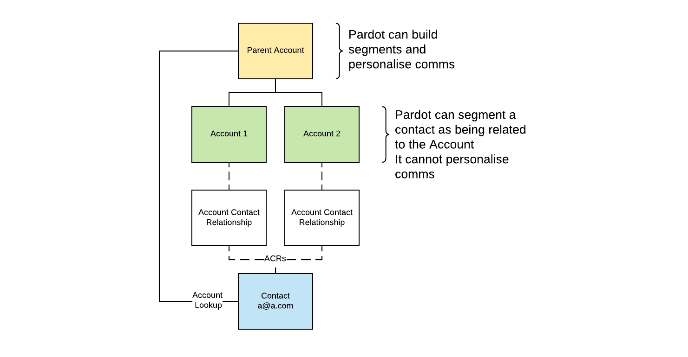
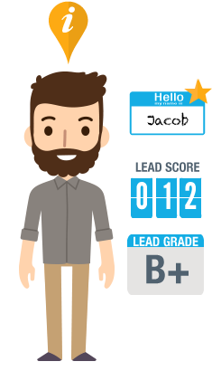

## Introduction

The first question you've probably got is what's the image at the top of the page all about?

Whenever I think about Contacts to Multiple Accounts, I’m always reminded of the phrase, “wearing more than one hat”, which means having more than one role or responsibility at the same time. 

That’s the scenario C2MA was designed to support - when one person has an association to more than one company or organisation.

I've transcribed my talk from Pardreamin 2021 below, for anyone who wasn't able to make the session. [Here's a link to the slides.](https://docs.google.com/presentation/d/1uaq8O7SdA6IVzfuaStKFTQkxndirecb_ACjE5O6jW9s/edit?usp=sharing)

## Why is Contacts to Multiple Accounts needed?

Let’s start with looking at a small bit of theory to give some context to anyone unfamiliar with Contacts to Multiple Accounts.

I’ve got really tired of writing that in full over the last year or so, so from here on in, you might see it written as C2MA instead.

It’s useful to start by looking at the default Salesforce object model, and checking how Accounts and Contacts relate to each other.

As you can see from the diagram, an Account can have many Contacts related to it, but a Contact can only be related to one Account out of the box.

So this is a problem if you’re dealing with decision makers who *“wear more than one hat”*.

I’ve got a few examples here, some of the most common ones I’ve seen in person or read about.

*   Maybe your target market is the healthcare industry… it’s quite common for clinical practitioners such as doctors, dentists and opticians to work for more than one hospital or healthcare facility
*   Or perhaps you’re targeting marketing consultants, who might have a vendor relationship to multiple accounts as an external consultant.
*   Also don’t forget about business owners or entrepreneurs, who might have founded or own more than one company. It’s worth thinking about How would you represent Elon Musk as a Contact in Salesforce, if you were trying to sell to SpaceX and Tesla at the same time?
*   Beyond that, a couple more examples could be that a person can join more than one membership organisation, or donate to multiple charities

## How to enable Contacts to Multiple Accounts

`Feature Settings → Sales → Account Settings → Edit → Allow users to relate a contact to multiple accounts`

[I’ve included a link here](https://help.salesforce.com/s/articleView?id=sf.shared_contacts_set_up.htm&type=5) to the implementation guide, and if you follow that, one of the steps you’d take is to add your Related Accounts List to the Related List section of your Contacts `Page Layout`, and this Related Contacts List to your Account `Page Layout`.

 

So ultimately you’ll be able to see which Contacts are associated with each Account, and which Accounts each Contact is associated to.

Couple of nice benefits to mention are that you can set whether the Contact is still `Active` at an Account, which solves that question everyone always has around *“What should I do when a Contact leaves the company?”* You can also set the start and end dates of them being associated to the Account - probably overkill to be honest.

Another thing I like is that you can set the `Role` the Contact has at each Account - it’s a clean way to define who are the gatekeepers, decision makers and influencers.

The `Direct` field is also really important.
You can’t edit it directly from the Account Contact Relationship record.
The `Direct` checkbox gets ticked when that account is set as the Contact’s Primary Account, which means it’s the Account selected under the Account Name lookup field on the Contact record.
Any other accounts added through the Add Relationship button on that related list, become non-direct Account links, where the link between the Contact and the Account only exists through the Account Contact Relationship object.

### Watch out for Account Contact Roles
There’s also a separate older feature called `Account Contact Roles`, which is very easy to confuse with Contacts to Multiple Accounts, but in fact is a completely separate feature. Two key points why it's less attractive for us to use 
* Firstly it’s only available in Salesforce Classic and not Lightning (the implication being that it's no longer seen as part of Salesforce's roadmap)
* Second, it’s not as attractive because you can’t create custom fields, or use validation rules or process builder on it

So what’s going on behind the scenes?

**Before we enable Contacts to Multiple Accounts**, if we want to represent a Contact’s relationship to a Parent Account and two Child Accounts, *and* we want to be able to send personalised emails about data we hold about each of those Account records, we need to duplicate the Contact multiple times and have one Contact linked to each Account. I don’t need to go into too much detail on why that’s a problem, but at a high level, you’re not getting a single view of that person’s interactions with you, and it makes things like marketing preference management challenging.

**After enabling contacts to multiple accounts**, we get the scenario in the image above, where a single Contact can have that direct relationship to an account, and then we can have records on the Account Contact Relationship junction object which sits between the Account and the Contact, and that forms an indirect relationship between the Contact and any additional Accounts.

The summary is that we can segment our audience based on data on the non primary Account records associated to a contact - we’re just not going to be able to personalise those emails.

## What does it mean for Pardot?

Pardot’s designed to take a Prospect, typically your B2B decision maker, on a Sales cycle, from awareness, through to sale and then help retain them as a client.

You can consider the Prospect as a single entity, which as a marketer, you combine with data from the Related Account and Related Opportunities, and you’re bringing that decision maker along your sales cycle by targeting them with personalised and relevant comms. 

But if you’re a business where each Account associated with a prospect is considered an entirely separate entity with a different Sales cycle and needs engagement and personalisation specifically on the Account level, this is where the Pardot data model falls short.

The main problem you’ve got is that we can only personalise emails based on the Account related to the Salesforce Contact with the Lookup field, which is what we called the Direct relationship earlier. It means we can never bring in things like the Account name, or any relevant personalisation details such as renewal date, address details, or any products or services the account has purchased.

So the question is, if we can’t do what we want out of the box, what can we do?

If we want to segment our audience based on fields on those non primary Accounts, we need to use Custom Objects in Pardot to map our Account Contact Relationship object.

We can then build Dynamic Lists in Pardot to build lists of Prospects who match certain criteria such as **"Show me a list of Prospects associated with an Account with a subscription date which expires in the next 30 days"**.

The challenge here is that by default the Account Contact Relationship record won’t hold information from the related Account, so you’ll need to use a Salesforce-side automation such as Flow to pass down information from the Account record to the Account Contact Relationship record related to it. You can then consume that data in Pardot.

That leads to the next point, where another workaround is that Pardot might not be the right tool for after you initially onboard a client, or it might not be the right tool for you at all.

Just a brief mention that **Marketing Cloud** has the capabilities to build a custom data model with its Data Extension functionality, so you’re not tied to the Prospect data model we looked at in Pardot. It’s a higher price solution, but really you’ve got more control over your data structure and email personalisation logic. Salesforce themselves do recommend using Pardot and Marketing Cloud together in some scenarios where you need higher levels of personalisation after the initial sale to a client.

## Further Reading

* [Video: Should I turn on Contacts to Multiple Accounts?](https://www.salesforce.com/video/1774934/)
* [Salesforce Help: Contacts to Multiple Accounts](https://help.salesforce.com/s/articleView?id=sf.shared_contacts_set_up.htm&type=5)
