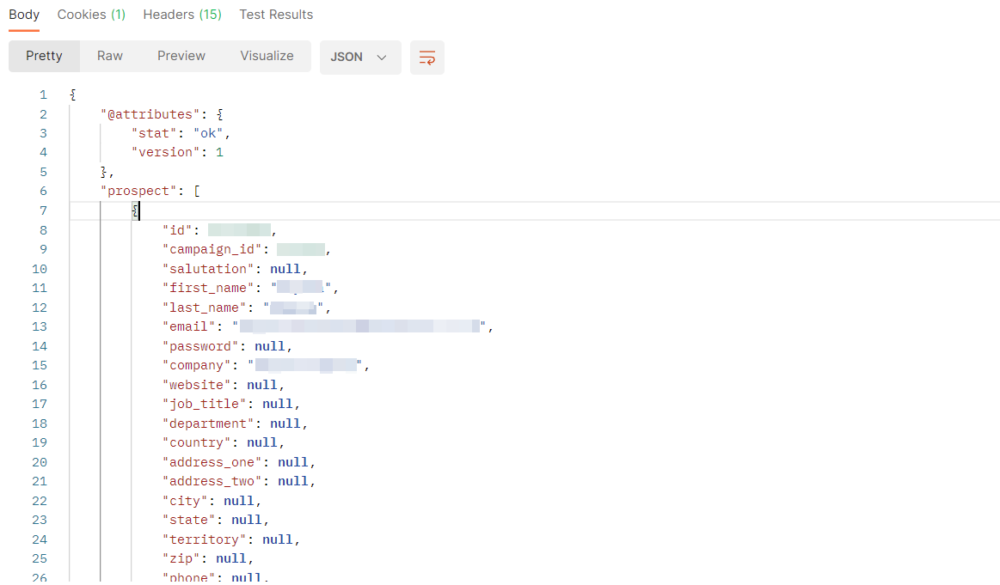
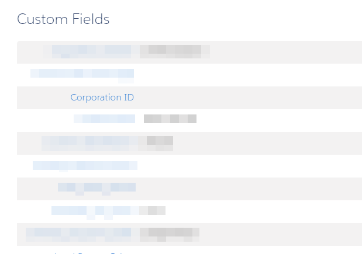
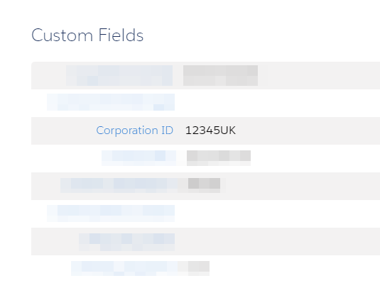
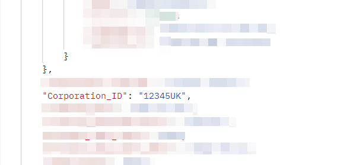

Today I encountered an interesting Pardot API question I'd never seen before, which was worth some exploration: A developer I'm working with was trying to manipulate a Pardot field - however when he performed a GET request on a Prospect to ensure the existing field value could be found, the field was missing from the API response.
<!--more-->

## Investigation

To get down to the solution, I like to use [Postman](https://www.postman.com/) for API testing. After following the [API Authentication documentation](https://developer.salesforce.com/docs/marketing/pardot/guide/overview.html), I connected to our lower environment (UAT) and pulled an example record's details with the [Prospect Read](https://developer.salesforce.com/docs/marketing/pardot/guide/prospects-v4.html#prospect-read) operation using a GET request in the following format:

> <https://pi.demo.pardot.com/api/prospect/version/4/do/<wbr>read/email/a@b.com&format=json>

When the response is returned, I can see all the details I would expect, except for that my desired field, `Corporation ID`, is not returned in the response:

As this is unexpected, we check the Pardot org. Are we perhaps logging into the wrong org/business unit? Did we create the custom field in a different org and not this one?

After verifying that everything is correct, we're logging into the right business unit and that the field does indeed exist, we check a few other fields. As we can see from the first screenshot, we expect to see a response returned for all fields, even if the values are null... or do we?

I can see the other custom fields which are populated, are returned in the API response, however all the custom fields which are not populated, are not returned in the response.

So if we add a value to the field we're looking for, we can test the hypothesis that custom fields are only returned if not equal to null.

After running our GET request again, we see that now, the field and value are both provided in the API response:

## Summary

We can see that custom fields with null values are not included in the Pardot API response, whereas custom fields with values are included. On the other hand, standard fields are always included, regardless of whether they are valued or null.

|                 | Valued                   | Null                     |
|-----------------|--------------------------|--------------------------|
| **Standard Fields** | Included in API Response | Included in API Response |
| **Custom Fields**   | Included in API Response | Not included             |