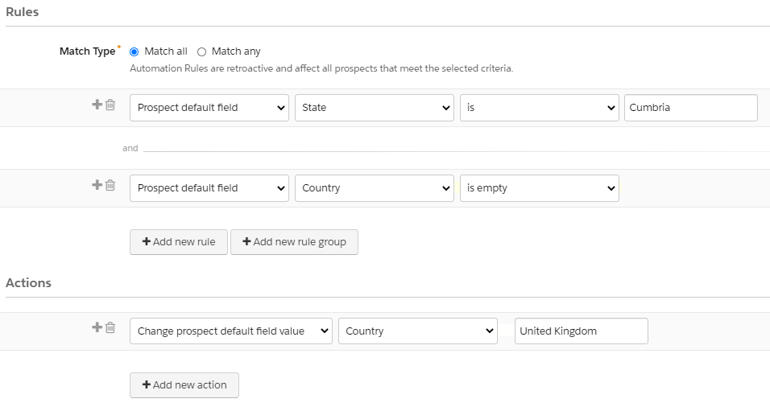
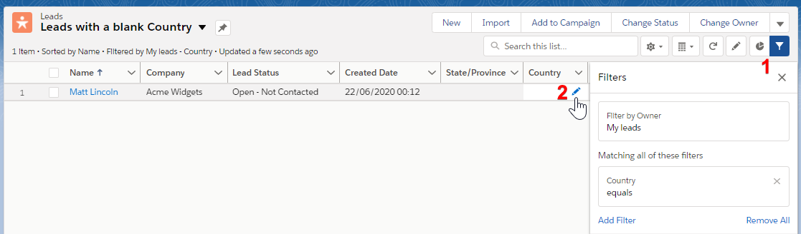

So, your Salesforce Admin just introduced a new Validation Rule, and subsequently, you noticed that your Sync Error queue in Pardot has been backlogged with an alarmingly high number of Prospects. 

When we think about sync errors, it's really easy to fall into the trap of assuming that Pardot is sending across invalid data into Salesforce.

In fact, that's not the most common scenario.

The way it normally plays out is that a SF Admin introduces a new Validation Rule, tests it successfully, then moves on to their next task. The hidden iceberg under the water, is that there's now an existing set of records in your Salesforce org that no longer meet the criteria for this Validation Rule.

This is great until Pardot wants to update the record. As we know, there are [plenty of triggers which cause Pardot to re-sync to Salesforce](https://help.salesforce.com/articleView?id=pardot_activities_that_trigger_a_sync_from_pardot_to_salesforce.htm&type=5) and this can be as simple as updating the Prospect's score based on them viewing a Landing Page or opening an Email.

Imagine that our SF Admin has introduced a Validation Rule to require the `City` to be populated when a Lead's `Country` is United Kingdom. The challenge here is that when Pardot attempts to update any field, whether that's `Score`, `Pardot URL`, or anything else not relevant to that Validation Rule, it's still triggered by Pardot's update, preventing Pardot from making updates to the record and bumping the Prospect into the Sync Error queue until re-sync is manually re-initiated.

There are quite a few approaches we can take here, each unfortunately having some compromises. There's no "one-size fits all" approach here, and it's likely that your choice will be determined by some combination of:

*   How your Salesforce Org is configured
*   The nature of the specific data point which is triggering the error
*   The level of time/resource available to you to resolve

### Allow Pardot to bypass the Salesforce Validation Rule

The easiest way to resolve your Validation Rule issue is to just ensure that it doesn't fire when the Pardot Connector User or Integration user updates a Salesforce record.

Questions to ask:

*   Is the validation relevant to Pardot forms or automations?
*   Would Pardot be expected to adhere to this rule?

If your answers above are all No, then you might consider this approach. This would be a code modification to the validation in Salesforce to ensure that it isn't applied to the Pardot integration user.

### Bypass the Validation Rule for legacy records only

This is a more nuanced approach than the previous option. By only allowing Pardot to bypass the Validation Rule for records created *before* the rule was launched, we are deciding that the validation *is* relevant from a Pardot perspective, however we have no way of fixing legacy records created before the rule was put in place.

Imagine if we have a million Lead or Contact records in Salesforce missing a highly individualised field such as `Budget` or `Product Interest`. We can't necessarily infer values from other field values or scrape them online, so the only way to populate these fields would be manual population by Sales reps. Unfortunately, once a record enters Pardot's sync queue, it's stuck there until the record no longer triggers the validation and a sync is triggered from Pardot. 

So yes, we would need to allow Pardot to bypass this validation, although what if it's information which Pardot needs to populate going forward? In this case, we could ensure that the field is mandatory only for Leads with a `Created Date` after the validation was introduced.

### Backfilling via Bulk update (e.g. inferrable picklist values)

Imagine that your Salesforce Administrator has introduced a Validation Rule to require the `County` field (You might know this as `State` or `Region`) to be populated. You might be able to use your power of inference to make reasonable assumptions about your data. If 25% of your Lead records are missing the `County` field, you could decide to look at what other data points you hold. Perhaps you have a `Town` populated, or a `Postcode` populated for the majority of those problematic records. In this case, we can work out a Lead's County from a `Postcode` or a `Town` - [this information is freely available](https://geoportal.statistics.gov.uk/datasets/ons-postcode-directory-november-2019) from the UK Office for National Statistics.

Similarly, `Telephone` country codes can be deduced from a `Country` field. Did they fill in an Italian language web form on your landing page? That's a reasonable assumption as a basis for populating your `Language` field. The possibilities are endless!

### Record Backfilling via Scraping

I know what you're thinking - it's a high risk, high reward approach, but for extremely large datasets, information such as company `Industry`, `Annual Revenue`, `Address` etc are readily available online and can be enriched into Salesforce to ensure that your newly mandatory fields are populated on old records.

If you do want to use data scraping tools to populate missing field values, it will be important to determine whether or not your company has a right to use scraped data. We have to be extra careful when we are pulling in data about individuals rather than companies. GDPR covers the protection of personal data of EU citizens; If you pull in data from the EU you must be sure that the data you are pulling is GDPR compliant.

### Surface non-compliant data to reps to manually fix

It's likely that both 'backfilling' approaches outlined above can only take you so far. Once you've enriched the data in bulk as far as possible, it's time for your Sales reps to get involved. List Views can be used to surface records to reps which need attention due to missing data points. Following the screenshot above, add your filters to show records with blank values for your key datapoints (point 1), and customise your List View columns to display the fields you expect Reps to populate. As a bonus, show the Reps how to use Inline Editing to update values without leaving the List View (point 2).

From an Admin perspective, consider Reports and Dashboards to show the progress of your data enrichment efforts. Once the data is populated with the missing values, you'll be able to manually sync records to remove them from the Pardot Sync Error queue.